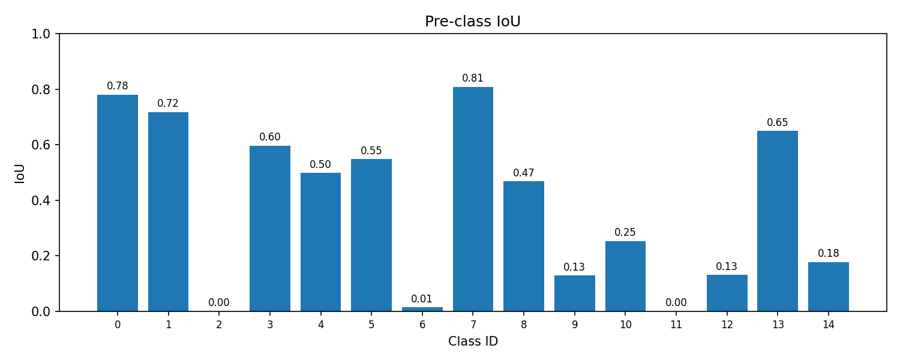
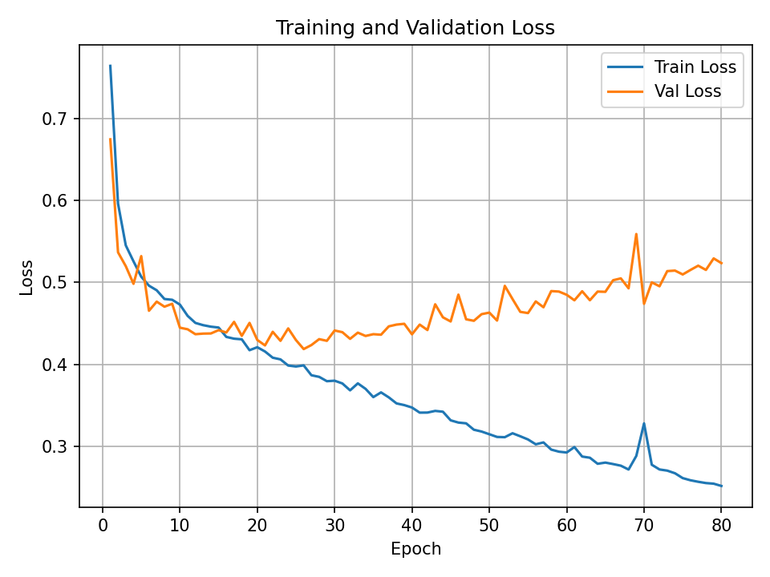
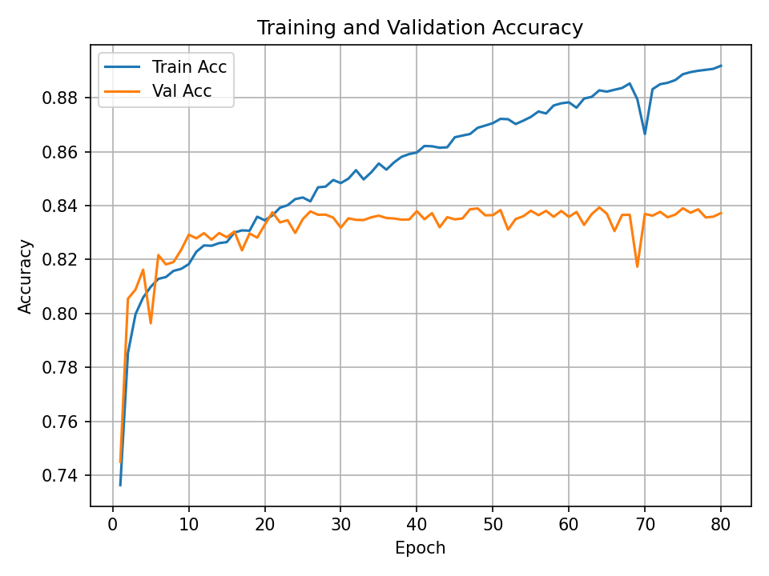
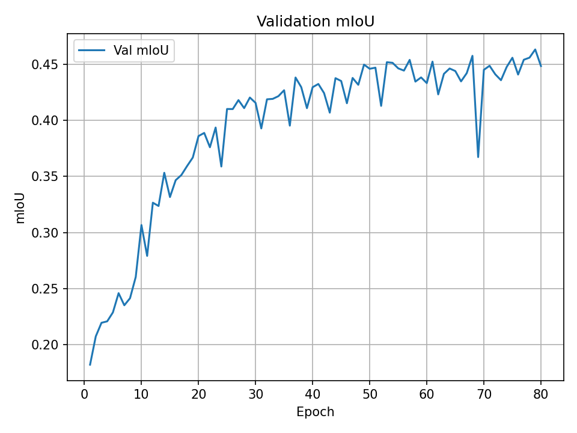
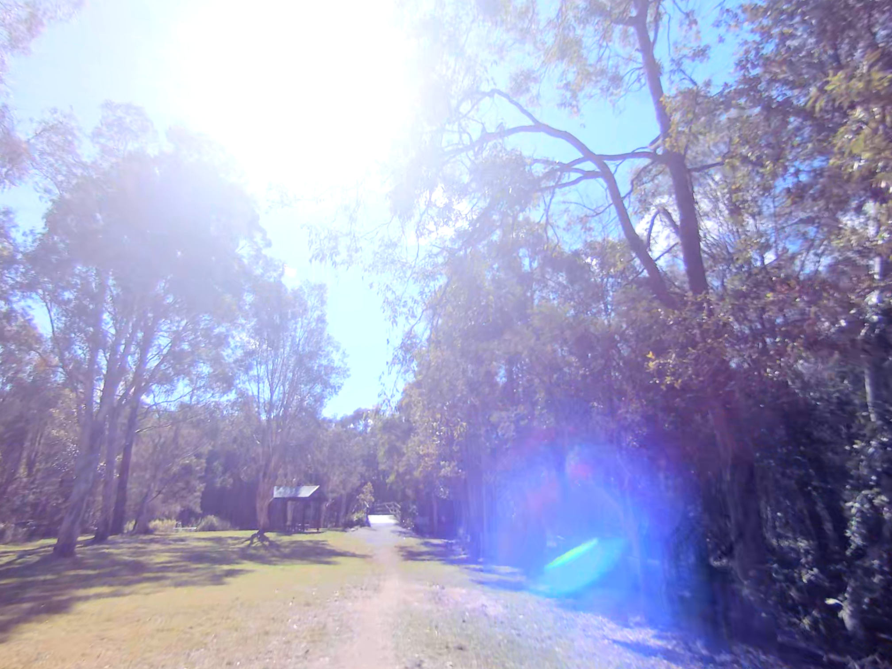
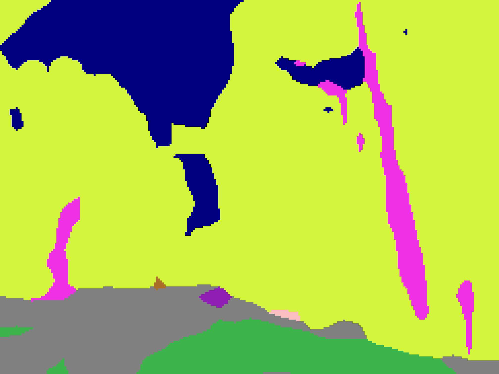

# Segmentation for Wildscenes Dataset using DeepLabV3

## Intro
This Project is aimed at using DeepLabV3 pretrained model to ahchieve segmentation for WildScenes Dataset (https://csiro-robotics.github.io/WildScenes/). The dataset contains cloud points data and 2D .png data. The 2D .png data from directory WildScenes2d is only used in the project.

## Repository Structure
```
├── demo.ipynb                    # Get the Color & idx mapper, Plot the train logs and Show the prediction result
├── color2id.json                 # Color & idx mapper
├── utils.py                      # Functions about resize, encode RGB into class idx, augmentation operations ...
├── dataset.py                    # Create pytorch dataset
├── train.py                      # Train and test
├── predict.py                    # Predict for a single image
```

## Background / Prequisition
The device used is an AMD6800XT GPU.\\
The core packages used includes torch, torchdml, Image.

## Usage
### 1. Clone the repo.
### 2. Download dataset into the repo direction.
### 3. Modify the dataset path in train.py, the params are also free to change.
```bash
python train.py
```
loss, acc, miou in each epoch will be printed and recorded into training_log.csv

### 4. Predict
```bash
python predict.py image_path
```
The predicted label .png will be saved as result*.png

## Result
### IoU of test dataset


### Training logs
<p>
  
  
  
</p>

### Predict result
<p>
  
  
  
</p>

## What is achieved
### 1. Using AMD GPU to finish a Segmentation task.

### 2. Using data Augmentation (flip, rotate, blur) while training.

### 3. Using early stop to avoid overfit while epoch increasing.

## Limitation / Future work
### 1. As device limitation, only part of data (2000 pairs) is used for training but there are totally more than 9000 pairs.

### 2. As time and device limitation, only one set of paramaters is used. We can use paramaters tunning to find the best set of paramaters in future.

### 3. As time limitation, the early stop is not trigger within 80 epoches (patients = 12). We can increase the number of epoches.
